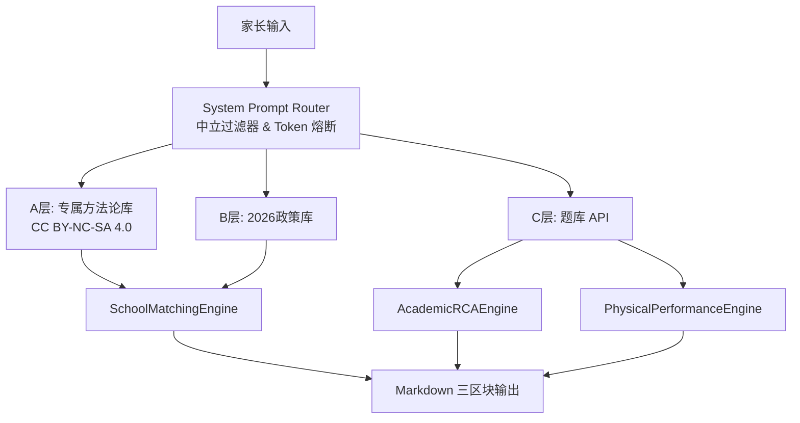

# HaidianParent.skill (Codename: HaidianMatrix)

> **家庭教育与儿童成长全生命周期数字资产管理系统 (海淀父母版 - MVP v1.0.0)**

[](https://opensource.org/licenses/MIT)
[](https://creativecommons.org/licenses/by-nc-sa/4.0/)
[]()

---

## 🎯 项目概述

HaidianParent.skill 是一个基于 Zoo Platform Skill Specification v1.0 的**家庭教育智能体**，专为 7–12 岁儿童家长设计，提供**择校规划、学科辅导、错题根因分析、体育健康管理**的一站式服务。

## 🏗️ 核心技术架构



### 核心引擎（MIT 授权）

| 引擎 | 功能 | 技术特点 |
|------|------|----------|
| `SchoolMatchingEngine` | 择校匹配与预算压力测试 | 412 前置条件检查、政策红线拦截 |
| `AcademicRCAEngine` | 错题根因分析（RCA） | 习惯粗心阈值 > 60% 停止加难度 |
| `PhysicalPerformanceEngine` | 体育达标逆向工程 | 膳食配给 55%:20%:25%、中考达标推演 |

## 📁 目录结构（关键文件）

```
HaidianParent/
├── skill.json                      # Zoo 舱单元数据（混合授权声明）
├── README.md                       # 混合许可证说明
├── LICENSE-CODE-MIT                # 代码 MIT 许可证
├── LICENSE-CONTENT-CC-BY-NC-SA-4.0 # 内容 CC BY-NC-SA 4.0 许可证
│
├── src/engines/                    # 核心引擎实现（MIT 授权）
│   ├── school_matching.py          # 择校引擎
│   ├── academic_rca.py             # 错题 RCA 引擎
│   └── physical_performance.py     # 体育引擎
│
├── prompts/                        # 核心提示词（CC BY-NC-SA 4.0）
│   ├── system_prompt.md            # 全局系统提示词
│   └── engines/                    # 引擎专属控制提示词
│
└── knowledge/                      # 知识库内容（CC BY-NC-SA 4.0）
    ├── private_methodology/        # A 层方法论（70% 权重）
    └── public_regulatory/          # B 层政策（30% 权重）
```

## 🚀 快速启动

```bash
# 克隆仓库
git clone https://github.com/[your-org]/HaidianParent.skill.git

# 安装依赖
cd HaidianParent
pip install -r requirements.txt

# 运行样例
python -m src.demo
```

## 5. 许可证与商用授权声明 (License & Commercial Terms)

本仓库采用**代码与内容分离的混合授权模式 (Split-Licensing Mode)**，请开发者与商业机构严格遵守以下边界：

### 💻 1. 代码与系统架构 (Source Code & Architecture)
*   **授权协议**：[MIT License](LICENSE-CODE-MIT)
*   **权益边界**：本仓库中的所有工程结构、前后端代码、JSON 数据结构定义（Data Schema）、API 接口逻辑等，均允许任何人自由用于个人、团队或**商业用途**。您可以基于此代码开发自己的商用产品而无需支付版税。

### 🧠 2. 核心提示词、知识库与方法论内容 (Prompts, Knowledge Base & Content)
*   **授权协议**：[CC BY-NC-SA 4.0 (知识共享-署名-非商业性使用-相同方式共享 4.0 国际许可协议)](LICENSE-CONTENT-CC-BY-NC-SA-4.0)
*   **权益边界**：本仓库中挂载的系统核心提示词（System Prompts）、教育策略知识库文本、学科方法论等**内容资产**，属于核心知识产权：
    *   **允许**：个人用户自由下载、阅读、编辑、根据自身家庭情况进行非商业性修改与微调。
    *   **严禁商用**：未经项目版权所有人明确的书面授权，**严禁**将上述提示词、知识库文本和内容用于任何营利性场景，包括但不限于：付费咨询工具、商业 AI 智能体上架、培训机构代教系统、付费社群内置服务。

### ⚠️ 商业授权获取途径 (Commercial Licensing)
如果您计划将本系统中的核心提示词（Prompts）或方法论内容整合进您的商业项目、机构服务或付费应用中，必须事先联系项目发起团队取得官方书面商业授权。

**联系邮箱：15628071@qq.com**

---

## 📞 联系

*   **项目维护**：HaidianParent.skill Project Team
*   **商业授权咨询**：15628071@qq.com
*   **开源问题反馈**：[GitHub Issues](https://github.com/[your-org]/HaidianParent.skill/issues)

---

Copyright (c) 2026 HaidianParent.skill Project. All Rights Reserved.