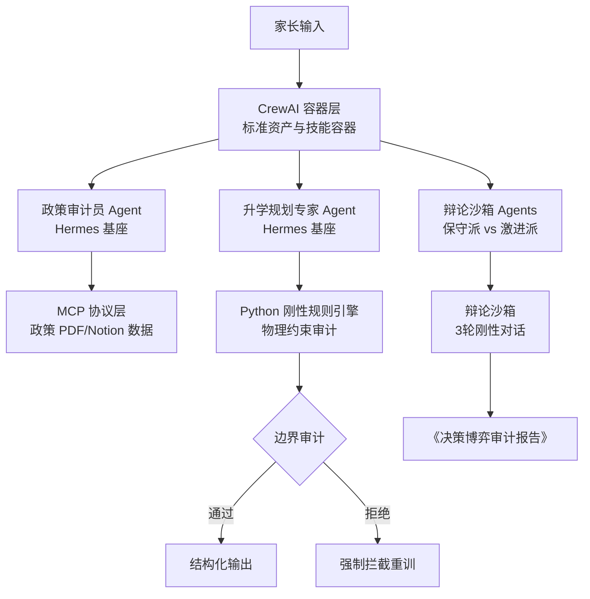

# HaidianParent.skill (Codename: HaidianMatrix)

> **家庭教育与儿童成长全生命周期数字资产管理系统 (海淀父母版 - MVP v1.0.0)**

[](https://opensource.org/licenses/MIT)
[](https://creativecommons.org/licenses/by-nc-sa/4.0/)
[]()
[]()

---

# 🛠️ 系统架构重构与底层代换说明

## 1. 重构的核心动机：框架先于功能

鉴于 AI Agent 技术的爆发式演进，本项目已进行**彻底的底层重构**。旧有代码因单文件 Prompt 堆叠、缺乏物理约束审计，无法应对高频政策波动和极端精确度要求，现决定**彻底抛弃旧有业务实现代码，仅保留原项目的版权声明、资产归属与核心说明文档**。

本次重构**不增加、不堆砌任何新的业务功能**，而是在彻底抛弃前期单文件堆叠的原型代码的基础上，全面解决系统的框架与底层解耦问题。

在海淀版育儿这种高复杂度、超长周期的项目管理场景中，如果底层的模块复用性、记忆连续性和算力基座没有标准规范，盲目堆砌新功能只会导致代码迅速腐烂、逻辑冲突以及严重的模型幻觉。因此，**先解决框架问题，是系统走向工业级应用的前提。**

---

## 2. 核心架构重构逻辑对照

本次重构通过三大核心底层组件的重组，实现了能力复用与智力闭环：

### 🔄 CrewAI 的角色代换：从"具体执行者"到"标准资产容器"

* **重构前：** 不同的智能体（Agent）和技能（Skill）零散分布，耦合度高，每次新增场景都需要重写大量对接代码。
* **重构后：** 将 CrewAI 规范化为一个标准的"资产与技能容器"。无论是针对哪个学科、哪类政策的 Agent、Skill，还是底层的 MCP (Model Context Protocol) 接口，全部抽象为 CrewAI 容器内的标准库组件。新场景、新智能体只需声明式导入（Declare），即可直接复用既有能力，实现即插即用。

### 🧠 Hermes 的角色代换：从"单轮对话模型"到"统一模型智力基座"

* **重构前：** 系统对模型的调用是零散且缺乏连续性的，大模型只负责在单次任务中输出文本，无法形成长期的经验资产。
* **重构后：** 全面确立 Hermes 作为全系统的统一模型智力基座与持续进化核心。

1. **长期记忆的无缝继承：** 利用 Hermes 强大的长上下文与长线角色一致性特长，完美承载孩子性格、情绪波动及家庭长线育儿哲学等非结构化资产。
2. **新 Agent 的无缝复用：** 无论未来在 CrewAI 容器中派生出多少个不同角色的新 Agent（如：政策审计员、升学规划专家、心理顾问），它们的底层逻辑、思维习惯和长期记忆，都能够 100% 复用和继承 Hermes 这个统一的智力基座，确保系统决策的长周期逻辑连贯性。

### 🛡️ 记忆双轨制与物理防线

* **框架保护机制：** 在锁死统一智力基座（Hermes）和标准容器（CrewAI）的同时，继续保留 **Python 刚性规则引擎**。将绝对数字（统测分、区排名）锁死在结构化数据库中，并在 Hermes 规划时由 Python 强行进行物理时间、财务预算的边界审计。一旦触碰边界（如编排时间超标），Python 直接引发异常拦截重训，确保高复用性的框架不会因模型的概率输出而产生幻觉坍塌。

---

## 3. 💡 架构总结

> 本次重构的本质，是利用 CrewAI 规范"生产关系"（做标准技能库与 Agent 容器），利用 Hermes 锁死"生产力"（做统一的长线记忆与模型智力基座），利用 Python 划定"物理红线"（做绝对数字和边界硬审计）。
>
> 架构重构不以"功能多寡"论成败，而以"逻辑自洽与框架复用"为核心。这不仅是代码的翻新，更是为未来智能体伴随孩子长线成长、实现真正的"经验增长与自主进化"打下不可动摇的工程地基。

---

### 新旧架构对照关系

| 维度 | 重构前（v1.0.0） | 重构后（v1.1.0） |
|------|-----------------|-----------------|
| 智能体组织 | 零散分布，高耦合 | CrewAI 标准资产容器，声明式导入 |
| 模型基座 | 单轮对话，无记忆连续性 | Hermes 统一智力基座，长线记忆继承 |
| 物理约束 | 软性检查，无强制审计 | Python 刚性规则引擎，边界拦截异常 |
| 接口协议 | 无标准化协议 | MCP 协议桥接，标准服务注入 |
| 扩展方式 | 重写对接代码 | 即插即用声明式导入 |



## 📁 重构后目录结构

```
HaidianParent.skill/
├── copyright.txt                    # 版权与资产归属说明（唯一保留的旧版文档）
├── README.md                        # 本文件
├── LICENSE-CODE-MIT                 # 代码 MIT 许可证
├── LICENSE-CONTENT-CC-BY-NC-SA-4.0  # 内容 CC BY-NC-SA 4.0 许可证
├── skill.json                       # Zoo 舱单元数据
│
├── config/                          # 声明式配置（重构新增）
│   ├── agents.yaml                  # 多智能体角色、环境与信任域配置
│   └── tasks.yaml                   # 任务流水线（政策审计、升学规划、辩论沙箱）
│
├── core/                            # 硬编码控制层（重构新增）
│   ├── __init__.py
│   ├── engine.py                    # 核心控制器：硬编码决策树、约束拦截器
│   └── sandbox.py                   # 辩论沙箱：多Agent竞争冲突解决机制
│
├── tools/                           # 工具层（重构扩展）
│   ├── mcp_bridge.py                # MCP协议桥接器，连接政策PDF/Notion数据
│   ├── custom_skills.py             # 纯Python刚性计算工具（时间漏斗、财务约束）
│   ├── health_ingress.json          # 原有健康工具
│   ├── policy_crawler.json          # 原有政策爬虫
│   └── question_bank_router.json    # 原有题库路由
│
├── main.py                          # 容器启动入口与CrewAI编排逻辑（重构新增）
├── requirements.txt                 # 依赖配置（已更新为重构版本）
│
├── src/                             # 原有引擎实现（MIT授权）
│   └── engines/
│       ├── school_matching.py       # 择校引擎
│       ├── academic_rca.py          # 错题RCA引擎
│       └── physical_performance.py  # 体育引擎
│
├── prompts/                         # 核心提示词（CC BY-NC-SA 4.0）
│   ├── system_prompt.md             # 全局系统提示词
│   └── engines/                     # 引擎专属控制提示词
│
└── schemas/                         # 原有数据Schema
    ├── error_logs_rca.json
    └── user_state.json
```

## 🔧 核心重构功能模块

### 1. 基于RAG与MCP的无噪音政策审计
- **输入边界**：教委官方文件PDF、派位比例表、招生截止时间
- **处理逻辑**：通过MCP接口精确提取无噪点、无情感修饰的一手数据
- **输出要求**：绝对事实陈述报告，严禁包含任何"推测"结论

### 2. 物理边界硬审计（时间/财务约束漏斗）
- **核心公式**：`t_free = 24 - (t_school + t_sleep + t_live)`
- **拦截机制**：当Agent编排的课外网课、奥数刷题、原版阅读时间总和`Σ t_tasks > t_free`时，Python控制层抛出`ConstraintsViolationError`，直接打回任务流，强制Hermes在约束框架内重新生成

### 3. 多Agent竞争辩论沙箱（Debate Sandbox）
- **保守派 (Agent B1)**：基于最低风险、就近派位、财务稳健原则
- **激进派 (Agent B2)**：基于科技特长、跨区加工能力、高收益高风险原则
- **控制机制**：Python硬编码限制双方辩论必须严格执行3轮，最终由Python计分器提取双方论据的交叉验证度

### 4. 记忆双轨制架构（重构防错核心）
1. **严禁全权依赖Hermes的内置大模型记忆记录绝对数字**：统测精确分数、区排名、全区划线指标必须存放在结构化本地JSON字典或轻量级数据库中
2. **释放Hermes的内置记忆特长于非结构化资产**：允许Hermes在长上下文中记忆孩子的性格特质、情绪挫败感、家庭长线教育风格

## 🚀 快速启动（重构版本）

```bash
# 克隆仓库
git clone https://github.com/canglangxifeng/HaidianParent.skill.git

# 进入项目目录
cd HaidianParent.skill

# 安装重构依赖（需更新requirements.txt）
pip install -r requirements.txt

# 启动重构系统
python main.py

# 或运行特定功能
python -c "from main import HaidianParentsAgentSystem; system = HaidianParentsAgentSystem()"
```

## 📊 依赖更新

重构版本新增以下核心依赖：
- `crewai>=0.28.8` - 多智能体协同框架
- `pydantic>=2.0.0` - 数据验证与配置管理
- `mcp>=0.1.0` - Model Context Protocol
- `pyyaml>=6.0` - YAML配置文件解析

## 🧪 测试验证

```bash
# 测试物理时间漏斗分析器
python -c "
from tools.custom_skills import TimeFunnelAnalyzer, TimeConstraint, Task
constraint = TimeConstraint(sleep_hours=8, school_hours=7, living_hours=3)
analyzer = TimeFunnelAnalyzer(constraint)
print(f'可用时间: {constraint.free_hours}小时')
"

# 测试决策树引擎
python -c "
from core.engine import DecisionTreeEngine
engine = DecisionTreeEngine()
print('决策树引擎初始化成功')
"

# 测试辩论沙箱
python -c "
from core.sandbox import DebateSandbox
sandbox = DebateSandbox(max_rounds=3)
print('辩论沙箱初始化成功')
"
```

## 📈 重构迁移指南

### 向后兼容性说明
- **旧有业务实现代码**：已被彻底弃用，建议迁移到新架构
- **原有数据Schema**：保持兼容，可通过适配器集成到新系统
- **原有提示词**：可转换为CrewAI Agent的backstory和goal配置
- **原有引擎**：可作为CrewAI Tools集成到新架构中

### 迁移建议
1. 将原有`src/engines/`转换为CrewAI Tools
2. 将原有提示词重构为`config/agents.yaml`中的角色定义
3. 使用`core/engine.py`中的硬编码约束拦截器替代原有的软性检查
4. 通过`tools/mcp_bridge.py`集成原有数据源

## 📄 许可证与商用授权声明 (保持不变)

本仓库采用**代码与内容分离的混合授权模式 (Split-Licensing Mode)**：

### 💻 1. 代码与系统架构 (Source Code & Architecture)
*   **授权协议**：[MIT License](LICENSE-CODE-MIT)
*   **权益边界**：本仓库中的所有工程结构、前后端代码、JSON数据结构定义（Data Schema）、API接口逻辑等，均允许任何人自由用于个人、团队或**商业用途**。

### 🧠 2. 核心提示词、知识库与方法论内容 (Prompts, Knowledge Base & Content)
*   **授权协议**：[CC BY-NC-SA 4.0](LICENSE-CONTENT-CC-BY-NC-SA-4.0)
*   **权益边界**：系统核心提示词、教育策略知识库文本、学科方法论等**内容资产**：
    *   **允许**：个人用户自由下载、阅读、编辑、根据自身家庭情况进行非商业性修改
    *   **严禁商用**：未经项目版权所有人明确的书面授权，严禁将上述内容用于任何营利性场景

### ⚠️ 商业授权获取途径
如果您计划将本系统中的核心提示词（Prompts）或方法论内容整合进商业项目，必须事先联系项目发起团队取得官方书面商业授权。

**联系邮箱：15628071@qq.com**

---

## 📞 联系

*   **项目维护**：HaidianParent.skill Project Team
*   **重构技术咨询**：GitHub Issues
*   **商业授权咨询**：15628071@qq.com
*   **GitHub仓库**：https://github.com/canglangxifeng/HaidianParent.skill

---

Copyright (c) 2026 HaidianParent.skill Project. All Rights Reserved.

*重构完成时间：2026年7月6日*
